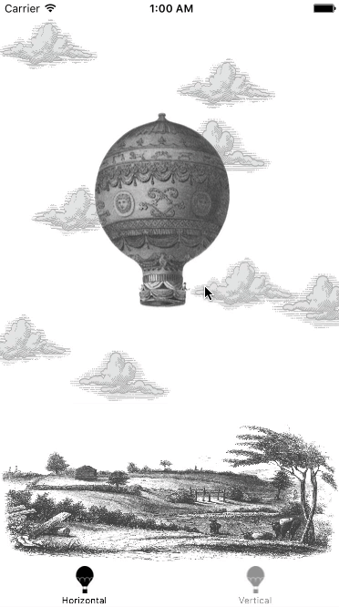

# MXParallaxBackground

[](https://travis-ci.org/maxep/MXParallaxBackground)
[](http://cocoapods.org/pods/MXParallaxBackground)
[](http://cocoapods.org/pods/MXParallaxBackground)
[](http://cocoapods.org/pods/MXParallaxBackground)

MXParallaxBackground is a simple background class for UIScrolView.

|          Horizontal           |          Vertical           |
|-------------------------------|-----------------------------|
|||

## Usage

If you want to try it, simply run:

```
pod try MXParallaxBackground
```

Or clone the repo and run `pod install` from the Example directory first.

+ Adding a parallax background to a UIScrollView is straightforward, e.g:

```objective-c
UIImageView *imageView = [UIImageView new];
imageView.contentMode = UIViewContentModeScaleAspectFill;
imageView.image = [UIImage imageNamed:@"Background"];
    
MXParallaxBackground *background = [MXParallaxBackground new];
background.view = imageView;
background.intensity = 0.75;

UIScrollView *scrollView = [UIScrollView new]; 
[scrollView addBackground:background];
```

## Installation

MXParallaxBackground is available through [CocoaPods](http://cocoapods.org). To install
it, simply add the following line to your Podfile:

```ruby
pod "MXParallaxBackground"
```

## Author

[Maxime Epain](http://maxep.github.io)

[](https://twitter.com/MaximeEpain)

## Credits

Images are taken from [this](http://jonathannicol.com/blog/2011/08/06/build-a-parallax-scrolling-website-interface-with-jquery-and-css/) tutorial made by [Jonathan Nicol](https://github.com/jnicol).

## License

MXParallaxBackground is available under the MIT license. See the LICENSE file for more info.
